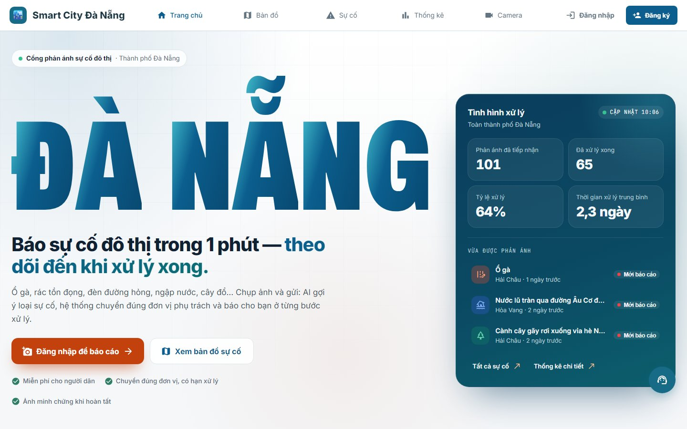
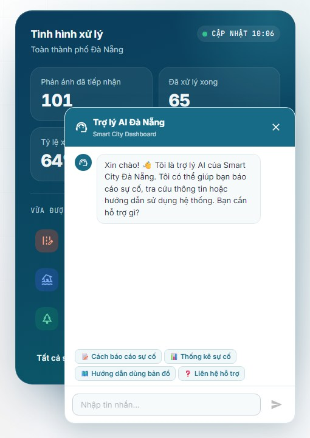
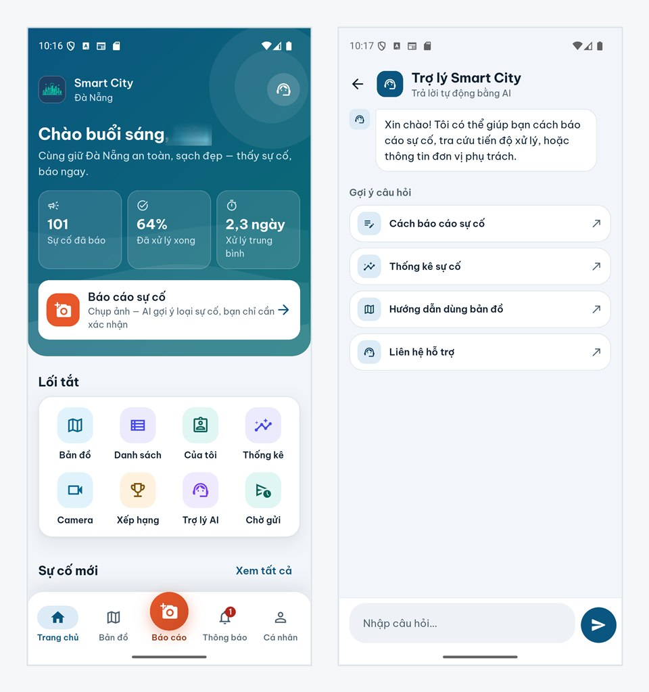
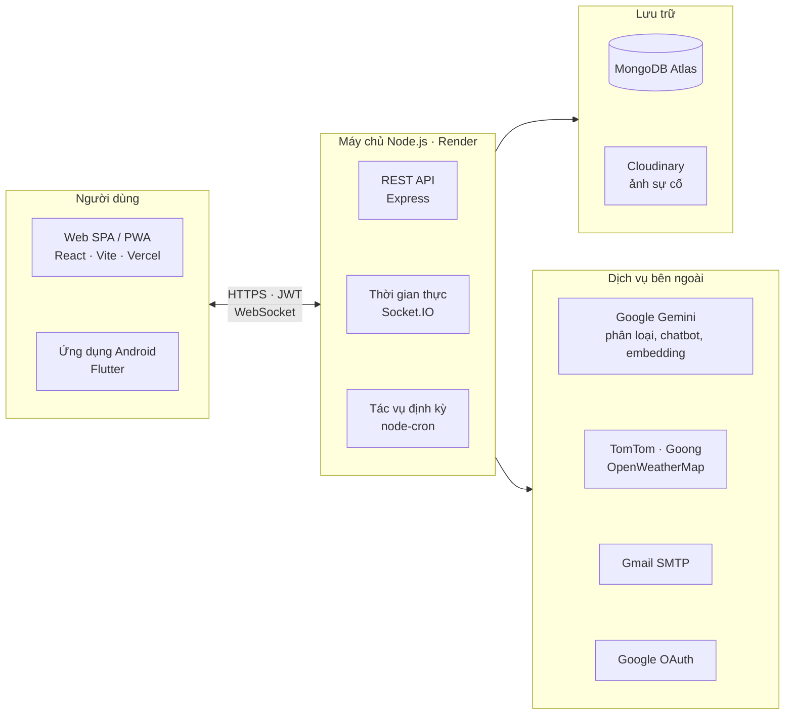
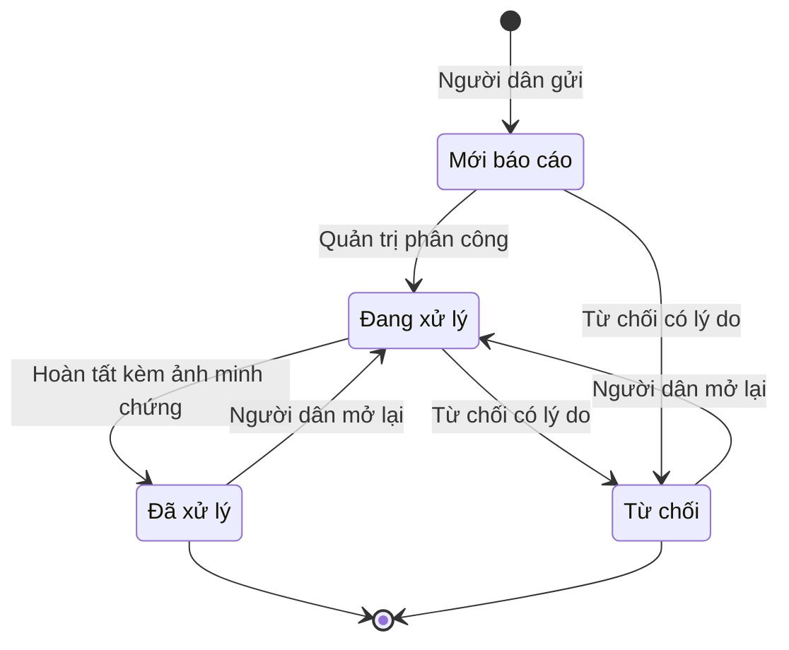

<div align="center">


# Smart City Đà Nẵng

**Hệ thống phản ánh và theo dõi xử lý sự cố đô thị: ứng dụng web, ứng dụng Android và REST API**

Người dân chụp ảnh sự cố, AI gợi ý loại sự cố, đơn vị phụ trách nhận việc và xử lý trong thời hạn,<br/>
người dân theo dõi từng bước và đánh giá kết quả.

[](https://github.com/Thanhhoai230504/Smart-City/actions/workflows/ci.yml)


[Giới thiệu](#giới-thiệu) · [Ảnh chụp màn hình](#ảnh-chụp-màn-hình) · [Tính năng](#tính-năng-nổi-bật) · [Kiến trúc](#kiến-trúc) · [Cài đặt](#chạy-trên-máy-cục-bộ) · [Kiểm thử](#kiểm-thử)

</div>

---

## Giới thiệu

**Smart City Đà Nẵng** là cổng phản ánh sự cố hạ tầng đô thị: ổ gà, rác tồn đọng, đèn đường hỏng, ngập nước, cây đổ… Hệ thống khép kín toàn bộ vòng đời của một phản ánh: **tiếp nhận → phân công đúng đơn vị → xử lý có thời hạn (SLA) → hoàn tất kèm ảnh minh chứng → người dân đánh giá hoặc yêu cầu mở lại**. Mọi bên được báo cập nhật theo thời gian thực.

| Vai trò | Nền tảng | Làm được gì |
|---|---|---|
| **Khách** | Web, Android | Xem bản đồ và danh sách sự cố, thống kê công khai, giao thông, thời tiết, camera, hỏi trợ lý AI |
| **Người dân** | Web, Android | Gửi phản ánh có ảnh và vị trí, theo dõi tiến độ, nhận thông báo, đánh giá, mở lại, ủng hộ và bình luận |
| **Cán bộ đơn vị** | Web, Android | Nhận việc của đơn vị, cập nhật tiến độ, tải ảnh minh chứng, được nhắc khi sắp đến hạn |
| **Quản trị viên** | Web | Điều phối theo điểm ưu tiên, gộp phản ánh trùng, quản lý người dùng và đơn vị, thống kê, đánh giá hiệu suất đơn vị |

## Ảnh chụp màn hình

<p align="center">
  
  <br/><sub><b>Trang chủ web</b>: số liệu xử lý thật và các phản ánh mới nhất</sub>
</p>

<table>
  <tr>
    <td width="60%" align="center"><br/><sub><b>Trợ lý AI</b> hỏi đáp về hệ thống</sub></td>
    <td width="40%" align="center"><br/><sub><b>Web trên điện thoại</b></sub></td>
  </tr>
</table>

<p align="center">
  
  <br/><sub><b>Ứng dụng Android (Flutter)</b>: trang chủ và màn hình trợ lý</sub>
</p>

## Tính năng nổi bật

**Cho người dân**
- Gửi phản ánh trong khoảng một phút: tối đa 5 ảnh, lấy vị trí bằng GPS, chấm trên bản đồ hoặc tìm theo địa chỉ.
- **AI gợi ý loại sự cố** từ ảnh (Google Gemini). Hệ thống cũng **cảnh báo phản ánh trùng** ở gần đó trước khi gửi.
- Theo dõi trạng thái, huy hiệu hạn xử lý và lịch sử xử lý. Có thể đánh giá 1–5 sao cho mỗi lượt xử lý, hoặc **yêu cầu mở lại** (tối đa 2 lần trong 30 ngày).
- Ủng hộ "Tôi cũng gặp", bình luận, theo dõi khu vực mình sống, huy hiệu và bảng xếp hạng.
- Ứng dụng Android có **hàng đợi ngoại tuyến**: mất mạng vẫn lưu được phản ánh và tự gửi lại khi có mạng.

**Cho cán bộ và quản trị viên**
- Hàng chờ phân công sắp theo **điểm ưu tiên 0–100**. Điểm tính từ mức nghiêm trọng, thời gian tồn đọng, lượt ủng hộ, mật độ sự cố và khoảng cách tới bệnh viện, trường học, kèm giải thích từng thành phần.
- Phân công cho đơn vị hoặc cán bộ. Cán bộ có hai danh sách: việc của cả đơn vị và việc mình đã nhận; nhận việc, cập nhật tiến độ và hoàn tất kèm ảnh minh chứng.
- **SLA hai mốc** (hạn tiếp nhận và hạn xử lý). Hệ thống tự nhắc hạn và leo cấp khi trễ, gửi thông báo trong ứng dụng và qua email.
- Gộp phản ánh trùng (dò bằng embedding, độ tương đồng cosine và khoảng cách địa lý); thống kê; xuất Excel, in hoặc lưu PDF; đánh giá hiệu suất từng đơn vị theo kỳ; nhật ký kiểm toán.

**Nền tảng**
- Thông báo **thời gian thực** qua Socket.IO, kèm email theo từng loại thông báo.
- Dữ liệu đô thị công khai: bản đồ sự cố, giao thông (TomTom), thời tiết (OpenWeatherMap), camera công cộng, chỉ đường.
- **Bảo mật**:
  - Xác thực: JWT kèm xoay vòng refresh token theo từng thiết bị; khoá tài khoản tăng dần khi đăng nhập sai.
  - Chống lạm dụng: 7 bộ giới hạn tần suất; Helmet và CORS; kiểm tra mọi dữ liệu đầu vào.
  - Dữ liệu: che thông tin liên hệ với người không có quyền; xoá mềm.
- Web là **PWA** (cài được như ứng dụng), tải trang theo yêu cầu và tách gói thư viện để mở nhanh.

## Kiến trúc



Vòng đời của một phản ánh:



## Công nghệ

| Thành phần | Công nghệ chính |
|---|---|
| **Backend** | Node.js 18/20, Express 4, Mongoose 8 (MongoDB), Socket.IO 4, JWT, bcryptjs, Helmet, express-rate-limit, express-validator, Multer + Cloudinary, node-cron, Nodemailer, Passport (Google OAuth) |
| **Web** | React 18, TypeScript 5.6, Vite 6, MUI 6, Redux Toolkit, React Router 7, Axios, socket.io-client, Leaflet, Recharts, SheetJS, vite-plugin-pwa |
| **Ứng dụng Android** | Flutter 3.41 (Dart 3.11), Riverpod, go_router, Dio, Hive, flutter_secure_storage, flutter_map, geolocator, image_picker, socket_io_client, google_sign_in |
| **AI** | Google Gemini: phân loại ảnh và chatbot (`gemini-2.5-flash`…), embedding `gemini-embedding-001` để dò phản ánh trùng |
| **Hạ tầng** | Render (API), Vercel (web), MongoDB Atlas, Cloudinary, GitHub Actions |
| **Kiểm thử** | Jest (backend), Vitest (web), flutter_test (ứng dụng) |

## Cấu trúc thư mục

```text
Smart-City/
├── Backend/                 # REST API + Socket.IO + tác vụ định kỳ
│   ├── server.js
│   └── src/
│       ├── config/          # kết nối DB, Socket.IO, Passport, kiểm tra biến môi trường
│       ├── routes/          # 20 nhóm route, 95 endpoint
│       ├── controllers/     # nhận request, trả response
│       ├── services/        # nghiệp vụ: phản ánh, phân công, SLA, ưu tiên, AI, thông báo…
│       ├── models/          # 10 model Mongoose
│       ├── middleware/      # xác thực, phân quyền, giới hạn tần suất, upload
│       ├── validators/      # kiểm tra dữ liệu đầu vào
│       ├── jobs/            # cron: SLA, ưu tiên, embedding, môi trường, báo cáo
│       ├── scripts/ seeds/  # backfill, đánh giá, dữ liệu mẫu
│       └── utils/
├── Frontend/                # Web SPA/PWA
│   └── src/ (api, components, hocs, hooks, layout, pages, router, store, types, utils)
├── App/                     # Ứng dụng Android Flutter, xem App/README.md
│   └── lib/ (core, data, features)
└── .github/workflows/ci.yml # CI: web, backend, ứng dụng, kiểm tra bảo mật
```

## Chạy trên máy cục bộ

**Yêu cầu:** Node.js 20 LTS, MongoDB (cục bộ hoặc Atlas), Git. Muốn chạy ứng dụng Android thì cần thêm Flutter 3.41 và Android SDK.

```bash
git clone https://github.com/Thanhhoai230504/Smart-City.git
cd Smart-City
```

**1. Backend** (http://localhost:5000)

```bash
cd Backend
npm ci --legacy-peer-deps   # cần cờ này vì multer-storage-cloudinary@4 khai peer cloudinary ^1
cp .env.example .env        # điền tối thiểu các biến ở bảng bên dưới
npm run dev
```

Kiểm tra máy chủ đã chạy bằng cách mở http://localhost:5000/health (trả `200` khi đã kết nối cơ sở dữ liệu).

Dữ liệu mẫu chỉ được nạp vào MongoDB **cục bộ**. Script tự từ chối nếu địa chỉ không phải localhost.

```bash
SEED_MONGODB_URI=mongodb://127.0.0.1:27017/smartcity_dev npm run seed   # in mật khẩu tài khoản mẫu ra màn hình một lần
npm run seed:departments                                                 # 6 đơn vị xử lý, ghi vào MONGODB_URI trong .env
```

Trên PowerShell, đặt biến môi trường theo cách: `$env:SEED_MONGODB_URI="mongodb://127.0.0.1:27017/smartcity_dev"; npm run seed`.

**2. Web** (http://localhost:3000; Vite chuyển `/api` sang backend cục bộ)

```bash
cd Frontend
npm ci
npm run dev
```

**3. Ứng dụng Android**

```bash
cd App
flutter pub get
flutter run --dart-define-from-file=config/dev.json   # máy ảo gọi API qua http://10.0.2.2:5000/api
```

Hướng dẫn build bản phát hành và ký ứng dụng có trong [App/README.md](App/README.md).

### Biến môi trường

Bản mẫu đầy đủ nằm ở [`Backend/.env.example`](Backend/.env.example). **Không đưa file `.env` lên git.**

| Biến | Bắt buộc | Mục đích |
|---|---|---|
| `MONGODB_URI` | ✅ | Chuỗi kết nối MongoDB |
| `JWT_SECRET`, `JWT_REFRESH_SECRET` | ✅ | Khoá ký token, mỗi khoá ≥ 32 ký tự và hai khoá phải khác nhau |
| `CLIENT_URL` | khuyến nghị | Địa chỉ web, dùng cho CORS và liên kết trong email |
| `GOOGLE_CLIENT_ID`, `GOOGLE_CLIENT_SECRET` | ✅ | Đăng nhập Google; server không khởi động nếu thiếu |
| `CLOUDINARY_*` | tuỳ chọn | Lưu ảnh sự cố |
| `GEMINI_API_KEY` | tuỳ chọn | AI phân loại, chatbot, dò trùng; thiếu thì dùng phương án dự phòng |
| `SMTP_EMAIL`, `SMTP_PASSWORD` | tuỳ chọn | Gửi email qua Gmail |
| `TOMTOM_API_KEY`, `GOONG_API_KEY`, `OPENWEATHER_API_KEY` | tuỳ chọn | Giao thông, địa chỉ, thời tiết |

Web đọc `VITE_API_URL` và `VITE_SOCKET_URL` (mặc định trỏ backend cục bộ). Ứng dụng nhận `API_URL` và `APP_ENV` qua `--dart-define`.

## Kiểm thử

| Thành phần | Lệnh | Kết quả (06/10/2026) |
|---|---|---|
| Backend | `cd Backend && npm test` | 87 bộ, 844 test đều qua |
| Web | `cd Frontend && npm test` | 186 test đều qua; `npx tsc --noEmit` và `npm run lint` không có lỗi |
| Ứng dụng | `cd App && flutter analyze && flutter test` | `flutter analyze` không báo lỗi; 329 test đều qua |

Mỗi lần push hoặc mở pull request, [GitHub Actions](.github/workflows/ci.yml) chạy 4 nhóm việc:
- **Web**: lint, kiểm tra kiểu, test và build, trên Node 18 và 20.
- **Backend**: lint, test và đo độ phủ, trên Node 18 và 20.
- **Ứng dụng Flutter**: phân tích mã, test và build APK.
- **Bảo mật**: rà lỗ hổng của các gói phụ thuộc và quét khoá bí mật trong mã.

## Triển khai

| Thành phần | Nền tảng | Ghi chú |
|---|---|---|
| API + Socket.IO + cron | [Render](https://render.com) | https://smart-city-tgsf.onrender.com/health. Gói miễn phí tự ngủ khi không có truy cập, lần gọi đầu có thể mất khoảng một phút |
| Web | [Vercel](https://vercel.com) | Build bằng `npm run build`, `vercel.json` chuyển mọi đường dẫn về SPA |
| Cơ sở dữ liệu | [MongoDB Atlas](https://www.mongodb.com/atlas) | |
| Ảnh | [Cloudinary](https://cloudinary.com) | |
| Ứng dụng Android | APK | `flutter build apk --release --split-per-abi`, xem [App/README.md](App/README.md) |

<!-- Thêm đường dẫn web demo sau khi có: [Xem bản chạy thử](https://<ten-mien>.vercel.app) -->

## Hạn chế và hướng phát triển

- **Đã làm**: nền tảng xử lý phản ánh khép kín trên web và Android, có realtime, SLA và AI hỗ trợ.
- **Chưa có**:
  - Thông báo đẩy (FCM), vì còn chờ cấu hình Firebase.
  - Bản iOS chưa được kiểm thử.
  - Danh sách khu vực vẫn theo 8 quận/huyện cũ, chưa cập nhật theo đợt sắp xếp đơn vị hành chính từ 01/07/2025.
- **Dự kiến**:
  - Thông báo đẩy.
  - Bản đồ nền có giấy phép kèm gom cụm điểm.
  - Ký bản phát hành và đưa lên cửa hàng ứng dụng.
  - Kết nối với các kênh tiếp nhận phản ánh chính thức của thành phố.

## Tác giả

Đồ án tốt nghiệp. Mã nguồn do [@Thanhhoai230504](https://github.com/Thanhhoai230504) phát triển.

<!-- Bổ sung: Họ tên sinh viên, MSSV, lớp, trường, giảng viên hướng dẫn -->

## Giấy phép

Dự án chưa gắn giấy phép mã nguồn mở. Mọi quyền thuộc về tác giả; vui lòng liên hệ trước khi sử dụng lại mã nguồn.
